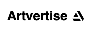
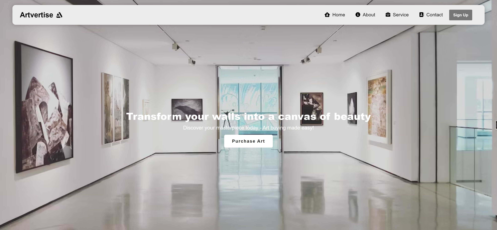

<p>

</p>

<!-- PROJECT NAME -->
# Artvertise


An online marketplace for showcasing, selling, and bidding on art

<!-- TABLE OF CONTENTS -->
## Table of Contents

- [Introduction](#introduction)
- [Installation](#installation)
- [Usage](#usage)
- [Configuration](#configuration)
- [Documentation](#documentation)
- [Authors](#authors)
- [Reporting](#reporting)
- [License](#license)

<!-- INTRODUCTION -->
## Introduction

Artvertise is an open-source e-commerce web application that aims to create a collaborative and inclusive platform for artists and art enthusiasts. The project focuses on facilitating the buying and selling of art in a seamless and user-friendly manner.

Key Features:

- Simplified UI: To ensure the artwork on display is done justice. We have made the interface as intuitive and simple as possible. We strive not to draw the users' attention away from the displayed art.
- Artist Showcase: Artists can create personalized portfolios to showcase their artwork, providing a comprehensive view of their creative journey.
- Secure Transactions: Artvertise ensures secure transactions between buyers and sellers, protecting the interests of both parties involved.

<!-- INSTALLATION -->
## Installation

To get started, clone the repository:
```
git clone https://github.com/Adisa-Shobi/Artvertise.git
```
### Backend

Navigate to the backend directory
```
cd backend
```
Install all required packages in the backend dir:
```
npm install
```

<!-- USAGE -->
## Usage

To get everything running, start up the express server by running
```
TOKEN_SECRET={INSERT TOKEN HERE} npm run start-server
```
Alternatively, you can configure `TOKEN_SECRET` as an env variable and use:
[Read](#configuration)
```
npm run start-server
```
Response:
```
vagrant@ubuntu-focal:~/Artvertise/backend$ TOKEN_SECRET="e2111fc1978a4fa6e77aa6c804e1e8ae4b18bb0e9d76ec4256f891e8451923bb" npm run start-server

> files_manager@1.0.0 start-server
> nodemon --exec babel-node --presets @babel/preset-env ./server.js

[nodemon] 2.0.22
[nodemon] to restart at any time, enter `rs`
[nodemon] watching path(s): *.*
[nodemon] watching extensions: js,mjs,json
[nodemon] starting `babel-node --presets @babel/preset-env ./server.js`
Running backend server on http://localhost:5001
```
### Frontend

To get frontend up and running, start the react application:
```
npm start
``` 


<!-- CONFIGURATION -->
## Configuration

Configure `TOKEN_SECRET` as an environment variable

```
export TOKEN_SECRET=your_token_secret_value
```

<!-- DOCUMENTATION -->
## Documentation

Full API documentation can be found [here.](https://documenter.getpostman.com/view/16948564/2s93Y5NzbR) 

<!-- AUTHORS -->
## Authors

| Author          | Role               | Contact                 |
|-----------------|--------------------|-------------------------|
| Shobi Ola-Adisa | Backend Developer  | s.oadisa.dev@gmail.com  |
| Jemimah Mmboga  | Frontend Developer | mmbogajemimah@gmail.com |
| Seth Kwame      | Backend Developer  | kseth8919@gmail.com     |          

<!-- Reporting -->
## Reporting

Feel free to [open an issue](https://github.com/Adisa-Shobi/Artvertise/issues) on GitHub if you find any bugs.

<!-- LICENSE -->
## License

This open-source software is licensed under the [MIT License](https://github.com/PawanKolhe/color-calendar/blob/master/LICENSE).

---
